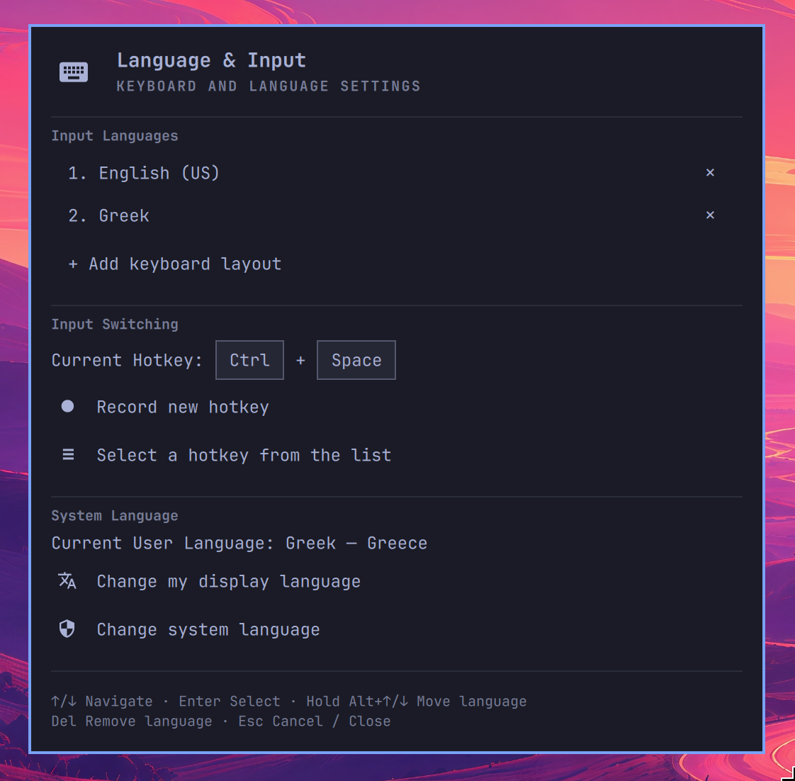

# Language & Input

Keyboard layouts, layout-switch shortcuts, and display languages in one
keyboard-friendly panel for **Omarchy Quattro**. No top-bar widget.



## Features

- **Input Languages** — browse languages and layout variants, add or remove
  layouts, and reorder with the keyboard or mouse.
- **Input Switching** — record a supported shortcut or choose one from the list.
- **System Language** — change your display language or the system default.

Settings autosave. Recorded shortcuts require confirmation, and language
changes may require logging out and back in.

## Install

```sh
omarchy plugin add https://github.com/Xarishark/Language-and-Input-Omarchy.git --enable
```

Open **Super+Space → Language & Input**. The menu entry is added automatically.

## Uninstall

```sh
omarchy plugin remove xarishark.language-input
```

Saved keyboard and language settings remain. The menu entry becomes hidden.
To remove that entry too, run this optional cleanup command:

```sh
sed -i -E '/^[[:space:]]*"language-input": \{.*\}[[:space:]]*,?$/d' ~/.config/omarchy/extensions/omarchy-menu.jsonc
```

This removes the generated one-line entry and preserves other menu entries.
If you reformatted it across multiple lines, remove its `language-input`
object manually instead.

## Requirements

- Omarchy Quattro with Hyprland and UWSM; tested on **Omarchy 4.0.4**.
- Python 3 and the system XKB/locale tools supplied by Omarchy.
- The current `~/.config/hypr/input.lua` keyboard configuration.

No build step or additional Python packages are needed. Shielded language
choices request administrator authentication.

## Keyboard controls

| Keys | Action |
| --- | --- |
| ↑ / ↓ | Navigate |
| Enter | Select or continue |
| Hold Alt + ↑ / ↓ | Move a language; release Alt to save |
| Delete | Remove the selected input language |
| Type in a language list | Filter languages |
| Ctrl+S / Ctrl+R | Save / retry a recorded hotkey |
| Esc | Back, cancel, or close |

Languages can also be reordered by dragging. Drop outside the list to cancel.

## Configuration

Keyboard changes preserve unrelated settings and XKB options, validate the
keymap, and use atomic writes with a backup and rollback. Account language
settings use `~/.config/uwsm/env.d/zz-language-input`; system language changes
use `localectl`. Omarchy core files are never modified.

Supports one to four input layouts. Device-specific overrides are retained.
Unsupported shortcut combinations are rejected rather than creating bindings.

## Development

QML handles presentation; `keyboard.py`, `locale_backend.py`, and
`menu_setup.py` handle system settings and menu registration. The root
`manifest.json` registers the `xarishark.language-input` panel.

Run from the repository root:

```sh
omarchy plugin validate .
python3 -m unittest -v test_keyboard.py test_locale_backend.py test_menu_setup.py
node test_shortcut.cjs
```

Node.js is needed only for shortcut tests. Test integration in a real Omarchy
session. Privileged locale changes, full logout/login behavior, and physical
side-specific modifier recording still need manual integration testing.

## License

[MIT](LICENSE). Upstream copyright notices are retained.
